# IoT-Based Automated Smart Irrigation System Using ESP32

---

## 1. Project Title
**IoT-Based Automated Smart Irrigation System Using ESP32**

---

## 2. Abstract
This project presents a low-cost, ESP32-based smart irrigation system that automates watering decisions using real-time soil moisture, soil pH, ambient temperature, and humidity readings. A companion mobile application, connected via Bluetooth Low Energy (BLE), allows the user to select a crop type from a predefined crop-configuration database. The ESP32 compares live sensor readings against crop-specific thresholds and autonomously controls a water pump using a hysteresis-based (target-range) irrigation algorithm, avoiding rapid on/off cycling. Soil pH is monitored (not corrected) and flagged to the user as "pH Suitable" or "pH Warning." Safety mechanisms — maximum pump runtime, sensor-failure detection, low-water detection, and emergency stop — protect the system against equipment damage and false readings. The result is an academic prototype demonstrating closed-loop, sensor-driven, crop-aware irrigation automation.

---

## 3. Problem Statement
Manual irrigation is inefficient: it either over-waters (wasting water, leaching nutrients, promoting root rot) or under-waters (causing crop stress) because it does not respond to actual soil conditions or crop-specific needs. Most low-cost irrigation timers operate on fixed schedules rather than real soil-moisture feedback, and few affordable systems account for soil pH suitability per crop. There is a need for an affordable, sensor-driven system that adapts irrigation to the actual condition of the soil and the specific requirements of the crop being grown.

---

## 4. Motivation
- Water scarcity makes efficient agricultural water use increasingly important.
- Smallholder and academic/hobbyist setups rarely have access to precision-agriculture tools.
- ESP32 + BLE + low-cost sensors make a working prototype achievable within a student budget.
- Demonstrates practical integration of embedded systems, mobile development, and control-system logic (hysteresis) in one project.

---

## 5. Objectives
1. Design an ESP32-based controller that reads soil moisture, soil pH, temperature, and humidity.
2. Implement a BLE link between the ESP32 and a mobile application.
3. Allow crop selection with predefined moisture/pH thresholds.
4. Implement hysteresis-based automatic pump control.
5. Monitor and alert on soil pH suitability.
6. Implement safety mechanisms against pump damage or sensor failure.
7. Provide manual override for direct pump control.
8. Document the system with clear architecture, data flow, and algorithm diagrams.

---

## 6. Scope
**In scope:**
- Automated irrigation based on soil moisture with crop-specific thresholds.
- pH monitoring and alerting (no automatic correction).
- Temperature/humidity display and optional influence on irrigation logic.
- BLE communication between ESP32 and mobile app.
- Manual/automatic pump modes.
- Core safety features.

**Out of scope (this version):**
- Automatic pH correction (chemical dosing).
- Cloud/internet connectivity (Wi-Fi/MQTT dashboards) — BLE only.
- Multi-zone irrigation (single pump/single zone assumed).
- Weather-API-based prediction.

---

## 7. Functional Requirements
| ID | Requirement |
|----|-------------|
| FR1 | System shall read soil moisture, soil pH, temperature, and humidity periodically. |
| FR2 | System shall allow the user to select a crop from a mobile app. |
| FR3 | System shall receive crop configuration (moisture min/target/max, pH min/max) over BLE. |
| FR4 | System shall turn the pump ON when moisture < minimum. |
| FR5 | System shall turn the pump OFF when moisture ≥ target. |
| FR6 | System shall compare pH against crop range and display "pH Suitable" / "pH Warning." |
| FR7 | System shall transmit sensor data and pump status to the mobile app continuously. |
| FR8 | System shall support manual pump ON/OFF override. |
| FR9 | System shall enforce maximum continuous pump runtime. |
| FR10 | System shall detect sensor failure/invalid data and stop the pump. |
| FR11 | System shall detect low/empty water level (if sensor present) and stop the pump. |
| FR12 | System shall support an emergency stop command from the mobile app. |

---

## 8. Non-Functional Requirements
- **Reliability:** Pump must never run without valid, recent sensor data.
- **Safety:** Hard runtime caps must not be bypassable by software error.
- **Usability:** Mobile UI must show live status in ≤ 2 seconds of connection.
- **Maintainability:** Firmware structured into independent modules.
- **Power efficiency:** BLE (not Wi-Fi) chosen for lower power draw.
- **Portability:** System should run on batteries/solar with a voltage regulator.
- **Extensibility:** Crop configuration structure should support adding new crops without firmware changes.

---

## 9. Hardware Requirements
- ESP32 development board (BLE + sufficient GPIO/ADC)
- Capacitive soil moisture sensor
- Soil pH sensor (analog, e.g., pH probe + interface board)
- DHT11 or DHT22 (temperature + humidity)
- Relay module or MOSFET driver (pump switching)
- DC water pump (5V/12V submersible, per reservoir size)
- Water reservoir
- Drip irrigation tubing/pipes
- Power supply (regulated 5V/12V as required; battery + buck converter optional)
- Optional: water-level float sensor
- Optional: OLED/LCD (local status display)

---

## 10. Software Requirements
- **ESP32 firmware:** Arduino/ESP-IDF (C/C++), BLE stack (NimBLE or default ESP32 BLE library)
- **Mobile application:** Flutter or native Android (Kotlin) with BLE plugin
- **Development tools:** Arduino IDE / PlatformIO, Android Studio (or Flutter SDK)
- **Data format:** JSON over BLE GATT characteristics
- **Version control:** Git

---

## 11. System Architecture
Three logical layers:
1. **Perception Layer** — sensors (moisture, pH, DHT).
2. **Decision/Control Layer** — ESP32 firmware (data processing, crop comparison, irrigation/safety logic).
3. **Interaction Layer** — mobile application (crop selection, monitoring, manual control) linked via BLE.

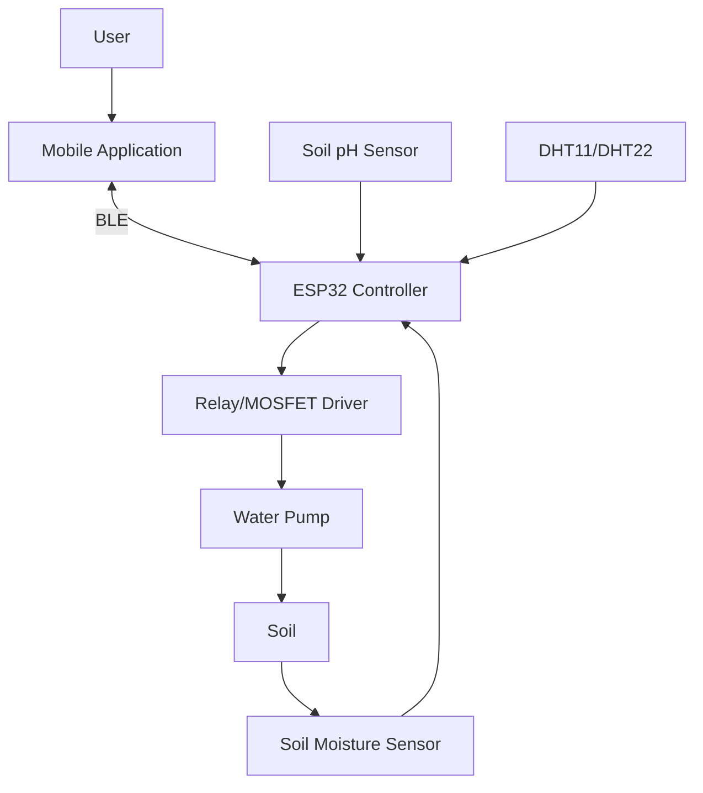

---

## 12. Hardware Architecture

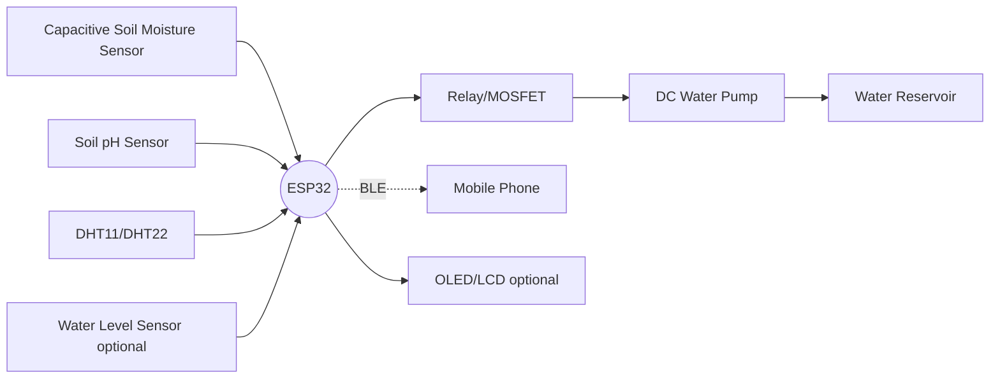

---

## 13. Software Architecture

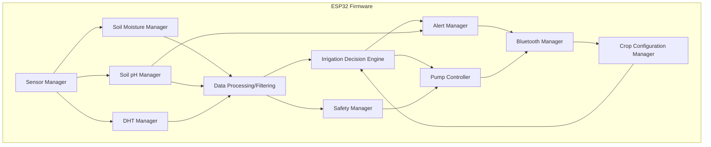

---

## 14. Complete Data Flow

**Irrigation path:**
```
USER → MOBILE APPLICATION → (BLE) → ESP32 → SENSOR ACQUISITION → DATA PROCESSING
→ CROP REQUIREMENT COMPARISON → IRRIGATION DECISION → PUMP CONTROL → WATER PUMP
→ SOIL → SOIL MOISTURE CHANGES → SENSOR FEEDBACK → ESP32 (loop)
```

**pH monitoring path (parallel):**
```
SOIL pH SENSOR → ESP32 → COMPARE WITH CROP pH RANGE → NORMAL / WARNING → MOBILE APPLICATION
```

**Environmental path (parallel):**
```
DHT11/DHT22 → ESP32 → TEMPERATURE + HUMIDITY → MOBILE APPLICATION
```

All three paths run concurrently on the ESP32's main sensing/control loop, sharing the same sensor-read cycle but feeding independent output channels (pump control vs. display alerts).

---

## 15. DFD Level 0 (Context Diagram)

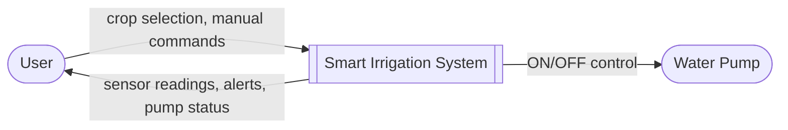
**Entities/Flows:** User (external entity) sends crop selection and manual commands into the System; the System returns live readings, warnings, and pump status; the System drives the Pump (external entity) directly.

---

## 16. DFD Level 1

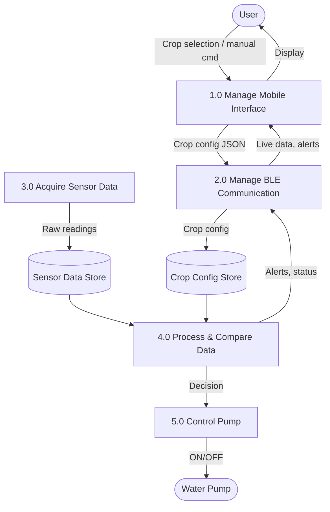
**Process notes:**
- *1.0 Manage Mobile Interface* — takes user input, displays sensor data/status; outputs crop config to BLE process.
- *2.0 Manage BLE Communication* — relays JSON packets both directions between phone and ESP32-side processes.
- *3.0 Acquire Sensor Data* — polls moisture/pH/DHT sensors; outputs raw values to sensor data store.
- *4.0 Process & Compare Data* — filters raw data, compares against crop config; outputs irrigation decision and pH/environment alerts.
- *5.0 Control Pump* — receives decision, drives relay/MOSFET, enforces safety limits.

---

## 17. DFD Level 2 (Expansion of Process 4.0 — Process & Compare Data)

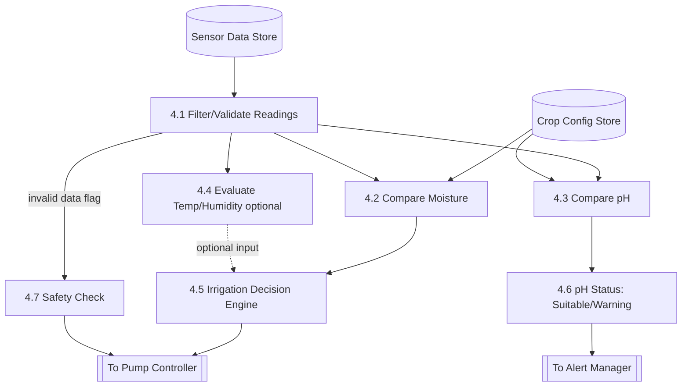

---

## 18. System Flowchart

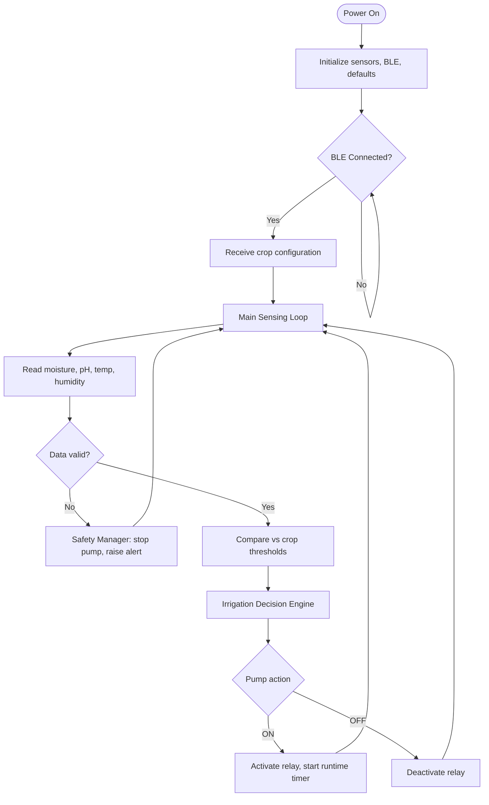

---

## 19. ESP32 Decision-Making Flowchart

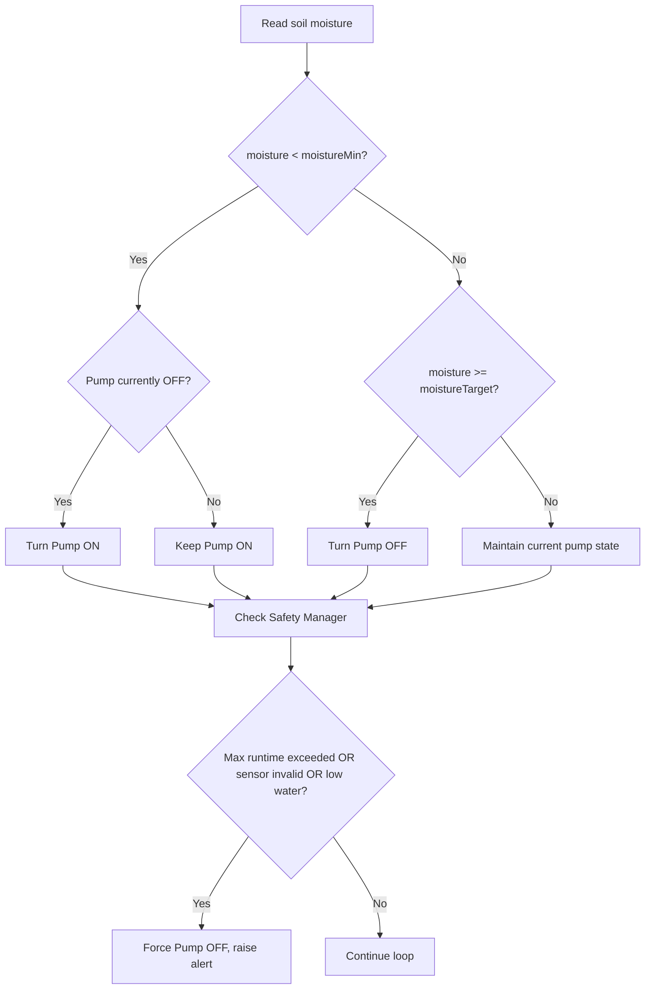

---

## 20. State Machine (Pump Controller)

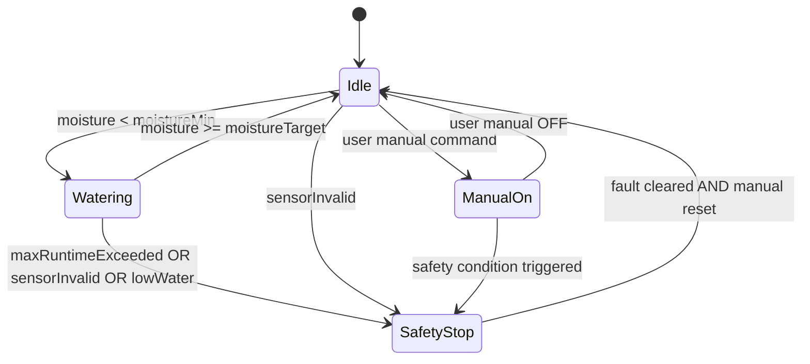

---

## 21. Mobile Application Architecture

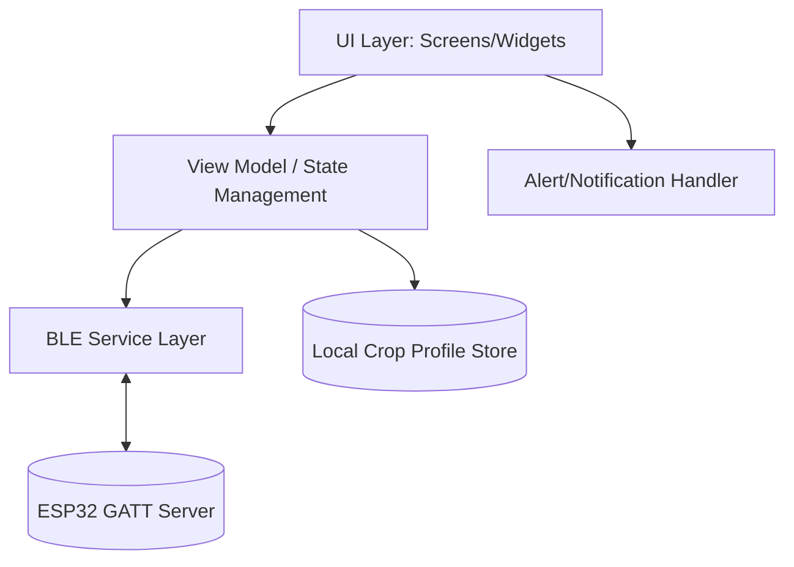
- **UI Layer:** Connection screen, crop selection, dashboard, manual control, alerts.
- **State management:** Holds current sensor snapshot, pump state, connection state.
- **BLE Service Layer:** Handles scanning, connecting, characteristic read/write/notify.
- **Local Crop Profile Store:** Predefined crop thresholds (can be a bundled JSON/SQLite table).

---

## 22. Bluetooth Communication Architecture

- **Role:** ESP32 = BLE Peripheral (GATT Server); Phone = BLE Central (GATT Client).
- **Service:** Custom "Irrigation Service" UUID.
- **Characteristics:**
  - `CropConfigChar` (Write): phone → ESP32, crop thresholds JSON.
  - `SensorDataChar` (Notify/Read): ESP32 → phone, live sensor + pump status JSON.
  - `ManualControlChar` (Write): phone → ESP32, manual pump ON/OFF/emergency-stop commands.

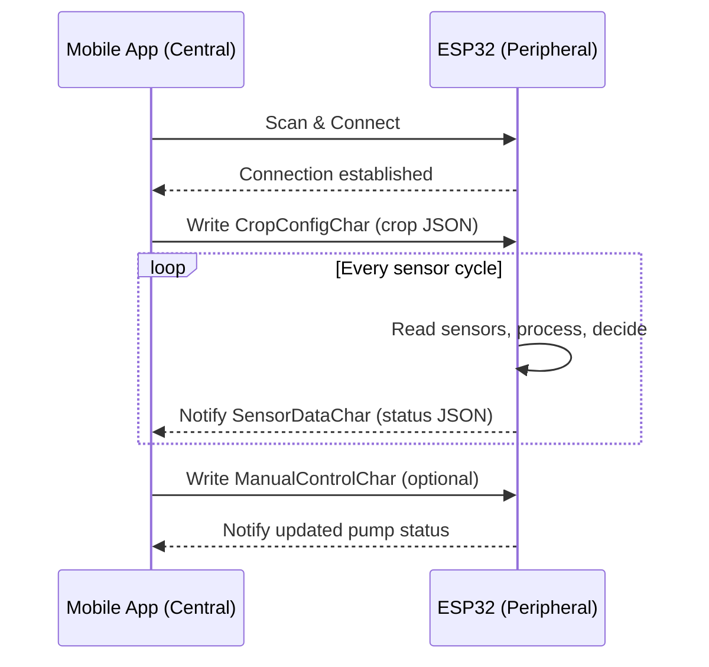

---

## 23. Database / Crop-Profile Structure

Stored on the mobile app (and mirrored transiently on the ESP32 after selection):

| Field | Type | Example (Tomato) |
|---|---|---|
| cropName | string | "Tomato" |
| moistureMin | int (%) | 45 |
| moistureTarget | int (%) | 65 |
| moistureMax | int (%) | 75 |
| phMin | float | 5.5 |
| phMax | float | 7.0 |

Example table (JSON array bundled in app):
```json
[
  {"crop": "Tomato", "moistureMin": 45, "moistureTarget": 65, "moistureMax": 75, "phMin": 5.5, "phMax": 7.0},
  {"crop": "Wheat", "moistureMin": 35, "moistureTarget": 55, "moistureMax": 65, "phMin": 6.0, "phMax": 7.5},
  {"crop": "Rice", "moistureMin": 60, "moistureTarget": 80, "moistureMax": 90, "phMin": 5.0, "phMax": 6.5}
]
```

---

## 24. Sensor Data Structure

ESP32 → Mobile App payload (sent via `SensorDataChar` notification):
```json
{
  "soilMoisture": 48,
  "soilPH": 6.2,
  "temperature": 30.5,
  "humidity": 62,
  "pumpStatus": "OFF",
  "phStatus": "pH Suitable",
  "mode": "AUTO",
  "crop": "Tomato",
  "fault": null
}
```
Mobile App → ESP32 payload (`CropConfigChar`):
```json
{
  "crop": "Tomato",
  "moistureMin": 45,
  "moistureTarget": 65,
  "phMin": 5.5,
  "phMax": 7.0
}
```

---

## 25. Irrigation Algorithm (Hysteresis-Based)

```
INPUT: soilMoisture, moistureMin, moistureTarget, pumpState

IF soilMoisture < moistureMin:
    pumpState = ON
ELSE IF soilMoisture >= moistureTarget:
    pumpState = OFF
ELSE:
    pumpState = UNCHANGED   // hysteresis band: hold current state

RETURN pumpState
```
This target-range (hysteresis) approach prevents rapid ON/OFF cycling ("chattering") that would occur with a single fixed threshold.

---

## 26. pH Monitoring Algorithm

```
INPUT: soilPH, phMin, phMax

IF phMin <= soilPH <= phMax:
    phStatus = "pH Suitable"
ELSE:
    phStatus = "pH Warning"

RETURN phStatus   // display only; no automatic correction
```

---

## 27. Safety Algorithm

```
INPUT: pumpRuntime, maxRuntime, sensorValid, waterLevelOK

IF pumpRuntime >= maxRuntime:
    forcePumpOff()
    raiseAlert("Max runtime exceeded")

IF NOT sensorValid:
    forcePumpOff()
    raiseAlert("Sensor failure detected")

IF NOT waterLevelOK:
    forcePumpOff()
    raiseAlert("Low water level")

IF emergencyStopReceived:
    forcePumpOff()
    raiseAlert("Emergency stop activated")
```
All safety checks run every loop cycle and override the irrigation decision engine (safety always takes priority over automatic control).

---

## 28. Pseudocode (Main Loop)

```
setup():
    initSensors()
    initBLE()
    pumpState = OFF
    mode = AUTO

loop():
    cropConfig = BLEManager.getLatestCropConfig()
    raw = SensorManager.readAll()          // moisture, pH, temp, humidity
    data = DataProcessing.filter(raw)

    sensorValid = DataProcessing.validate(data)
    waterLevelOK = SafetyManager.checkWaterLevel()

    if mode == AUTO and sensorValid:
        pumpState = IrrigationEngine.decide(data.moisture, cropConfig, pumpState)
    elif mode == MANUAL:
        pumpState = BLEManager.getManualCommand()

    phStatus = PHManager.evaluate(data.pH, cropConfig)

    pumpState = SafetyManager.enforce(pumpState, sensorValid, waterLevelOK, pumpRuntime)

    PumpController.set(pumpState)

    BLEManager.notify({
        soilMoisture: data.moisture,
        soilPH: data.pH,
        temperature: data.temp,
        humidity: data.humidity,
        pumpStatus: pumpState,
        phStatus: phStatus,
        mode: mode
    })

    delay(SAMPLE_INTERVAL)
```

---

## 29. ESP32 Firmware Structure

```
/firmware
 ├── main.cpp                  // setup() + loop()
 ├── SensorManager.h/.cpp       // orchestrates sensor reads
 ├── MoistureManager.h/.cpp
 ├── PHManager.h/.cpp
 ├── DHTManager.h/.cpp
 ├── BLEManager.h/.cpp          // GATT service/characteristics
 ├── CropConfigManager.h/.cpp
 ├── DataProcessing.h/.cpp      // filtering/validation
 ├── IrrigationEngine.h/.cpp
 ├── PumpController.h/.cpp
 ├── SafetyManager.h/.cpp
 └── AlertManager.h/.cpp
```
Each module exposes a small interface (e.g., `MoistureManager::readPercent()`) so modules can be unit-tested independently.

---

## 30. Mobile Application Screen Structure

```
1. Splash / Connection Screen — scan & connect to ESP32
2. Crop Selection Screen — list/search crop, confirm selection
3. Dashboard Screen — live moisture, pH, temp, humidity, pump status
4. Mode Toggle — Auto / Manual switch
5. Manual Control Screen — pump ON/OFF buttons (enabled only in Manual mode)
6. Alerts Screen — pH Warning, sensor fault, low water, emergency stop log
7. Crop Requirements Screen — shows selected crop's threshold values
```

---

## 31. Example UI Design (Textual Wireframe)

```
┌───────────────────────────────┐
│  Smart Irrigation      [●BLE] │
├───────────────────────────────┤
│ Crop: Tomato        [Change]  │
│ Mode: (Auto) / Manual         │
├───────────────────────────────┤
│ Soil Moisture   48%  [target65]│
│ Soil pH         6.2  pH Suitable│
│ Temperature     30.5 °C        │
│ Humidity        62%            │
│ Pump Status     ● OFF          │
├───────────────────────────────┤
│ [Manual Pump ON] [Manual OFF] │
│ [Emergency Stop]               │
├───────────────────────────────┤
│ Alerts: none                   │
└───────────────────────────────┘
```

---

## 32. Complete Working Sequence

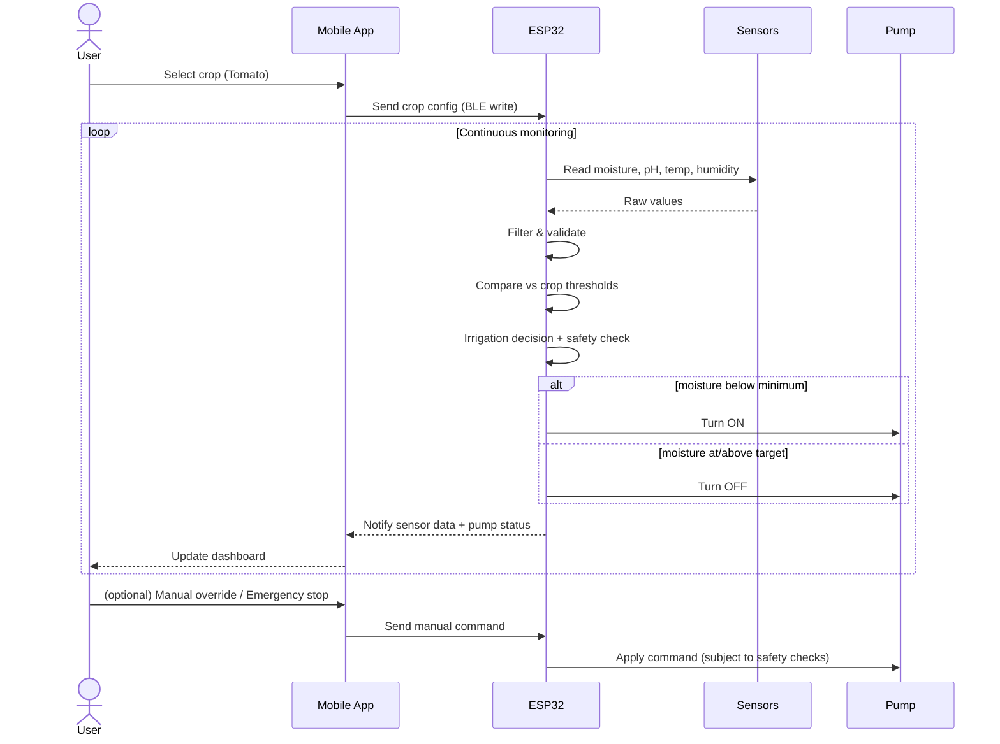

---

## 33. Test Cases

| # | Scenario | Input | Expected Output |
|---|----------|-------|------------------|
| 1 | Dry soil | moisture=30, min=45, target=65 | Pump ON |
| 2 | Soil reaches target | moisture=66, target=65 | Pump OFF |
| 3 | Hysteresis band (no flicker) | moisture=50 (between min/target), pump was ON | Pump stays ON |
| 4 | pH within range | pH=6.0, range 5.5–7.0 | "pH Suitable" |
| 5 | pH outside range | pH=8.2, range 5.5–7.0 | "pH Warning" |
| 6 | Sensor disconnected | moisture reading = NaN/out-of-range | Pump forced OFF, "Sensor failure" alert |
| 7 | Max runtime exceeded | pump ON for > maxRuntime | Pump forced OFF, alert raised |
| 8 | Low water detected | waterLevel = LOW | Pump forced OFF, alert raised |
| 9 | Manual mode ON command | mode=MANUAL, user taps ON | Pump ON regardless of moisture |
| 10 | Emergency stop | user taps Emergency Stop | Pump OFF immediately, alert logged |
| 11 | BLE disconnects mid-session | connection lost | ESP32 retains last safe state / stops pump after timeout |

---

## 34. Expected Outputs
- Real-time dashboard reflecting current moisture, pH, temperature, humidity, and pump state within the sensor sampling interval.
- Automatic pump cycling that follows the hysteresis band without rapid toggling.
- Accurate "pH Suitable"/"pH Warning" labeling matching the selected crop's range.
- Pump halts automatically under any unsafe condition, with a corresponding alert visible in the app.
- Manual mode allows direct control, still bounded by safety checks.

---

## 35. Limitations
- Single-zone, single-pump design (no multi-bed/multi-zone support).
- BLE range limits deployment to short distances from the phone (no remote/cloud monitoring).
- No automatic pH correction — only alerting.
- Low-cost pH/moisture sensors can drift and require periodic calibration.
- No historical data logging/analytics in this version.
- Relies on the user's phone remaining in BLE range for live monitoring (though the ESP32 continues automatic control independently).

---

## 36. Future Improvements
- Add Wi-Fi/MQTT or cloud connectivity for remote monitoring and data logging.
- Add automatic pH correction (dosing pump for pH-adjusting solution).
- Multi-zone support with multiple pumps/valves and per-zone crop profiles.
- Data analytics dashboard (historical trends, water-usage reports).
- Weather-API integration to pause irrigation before rain.
- Solar-powered, fully off-grid deployment.
- Machine-learning-based irrigation scheduling using historical sensor trends.

---

## 37. Conclusion
This project demonstrates a complete, academically rigorous yet practically buildable smart irrigation prototype. By combining an ESP32 controller, low-cost environmental sensors, a BLE-linked mobile application, and a hysteresis-based decision engine with crop-specific thresholds, the system automates irrigation decisions while safeguarding against sensor faults, water shortages, and pump overuse. The modular firmware and clear architecture make the system straightforward to extend with future features such as pH correction, cloud connectivity, and multi-zone irrigation.

---

## Division of Responsibilities: ESP32 vs. Mobile Application

| Runs on **ESP32** | Runs on **Mobile Application** |
|---|---|
| Sensor Manager, Moisture/pH/DHT Managers | Crop selection UI |
| Data Processing/Filtering | Dashboard display (live data) |
| Crop Configuration Manager (holds config once received) | Local crop-profile database (predefined list) |
| Irrigation Decision Engine | Manual control UI |
| Pump Controller | Alert/notification display |
| Safety Manager | BLE central-side connection management |
| Alert Manager (raises alert flags) | Sending crop config & manual commands over BLE |
| Bluetooth Manager (GATT server) | — |

**Rationale:** All time-critical, safety-critical, and closed-loop control logic runs on the ESP32 so that irrigation and safety continue to function correctly even if the phone is temporarily out of BLE range or the app is closed. The mobile application is purely a configuration and monitoring interface.

---

*Verification note: all 37 requested sections, module list, communication examples, hardware list, safety features, and Mermaid diagrams for architecture, DFDs (Levels 0–2), flowcharts, state machine, and sequence diagram have been included above.*
